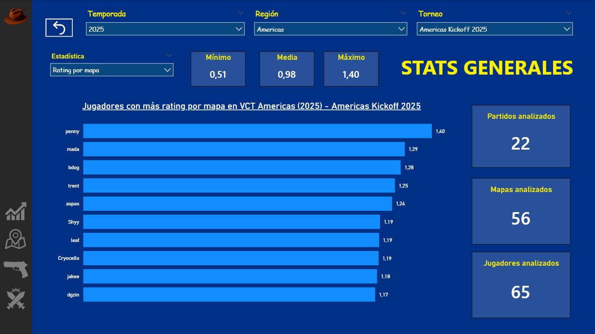
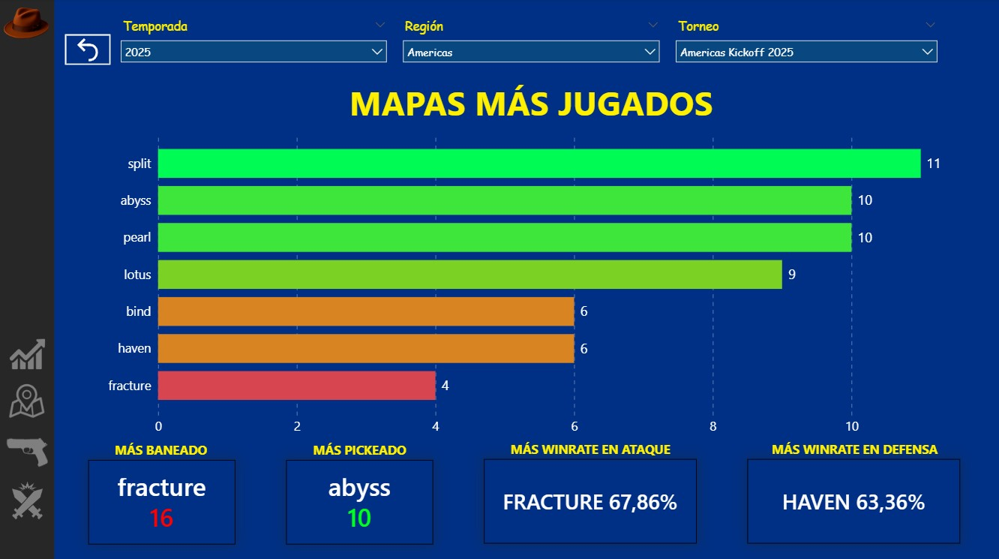
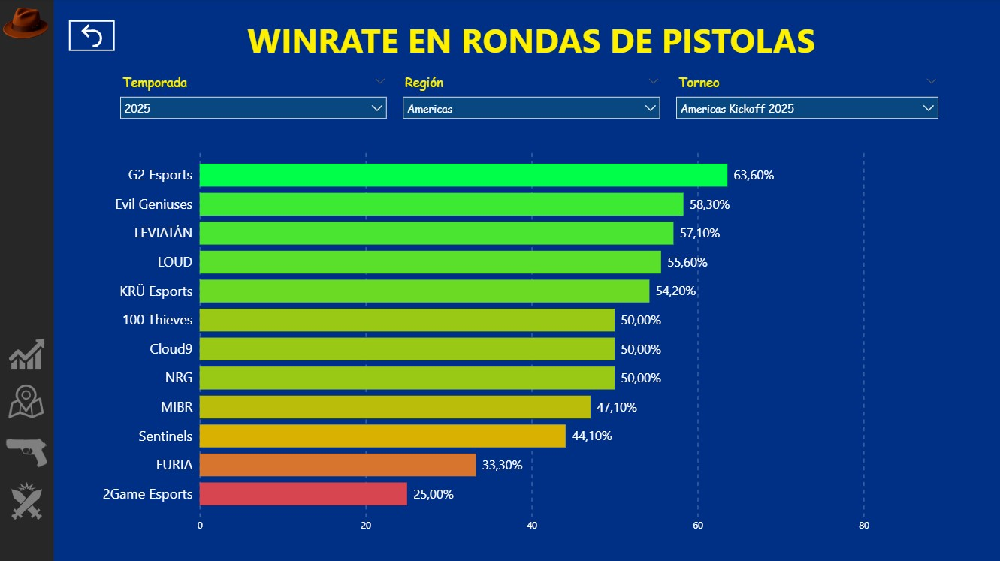
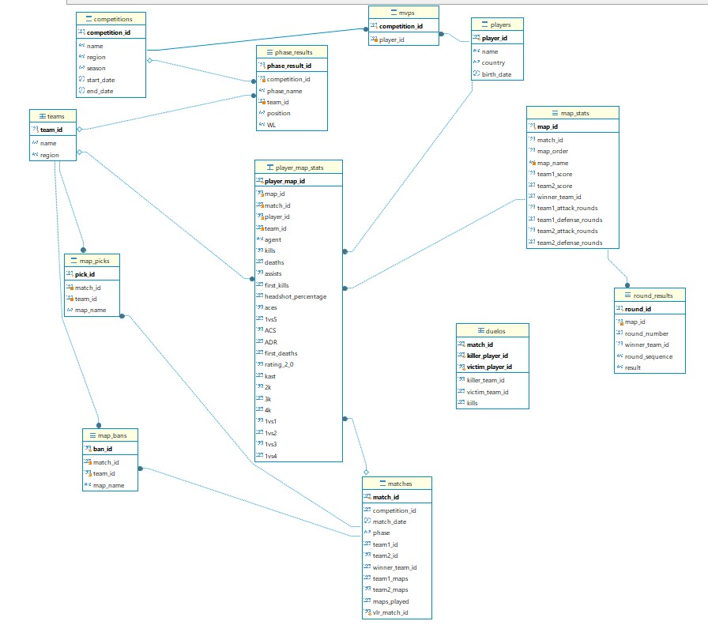

# VCT Analytics Dashboard | Power BI · MySQL · Python

Proyecto de análisis de datos centrado en el circuito profesional de **Valorant Champions Tour (VCT)**, desarrollado mediante **Python, MySQL, SQL y Power BI**.

---

# Vista previa del Dashboard
## Estadísticas generales

## Análisis de mapas

## Análisis de rondas de pistola

---

# Descripción del proyecto
Este proyecto fue desarrollado con el objetivo de analizar competiciones profesionales de Valorant mediante un dashboard interactivo en Power BI.

El flujo completo del proyecto incluye:
* Recopilación automática de datos mediante Python.
* Almacenamiento de la información en una base de datos relacional MySQL.
* Creación de vistas SQL orientadas al análisis.
* Desarrollo de un dashboard interactivo en Power BI.

---

# Tecnologías utilizadas
* Power BI
* MySQL
* SQL
* Python
* Selenium
* BeautifulSoup

---

# Funcionalidades del Dashboard
* Estadísticas de jugadores.
* Estadísticas de equipos.
* Análisis de rondas de pistola.
* Análisis del map pool.
* Estadísticas de picks y bans.
* Análisis del rendimiento en ataque y defensa.
* Filtros interactivos por temporada, región y torneo.

---

# Arquitectura de la base de datos

---

# Modelo de datos en Power BI

---

# Autor
**David Ponce**
